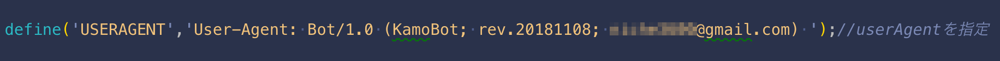
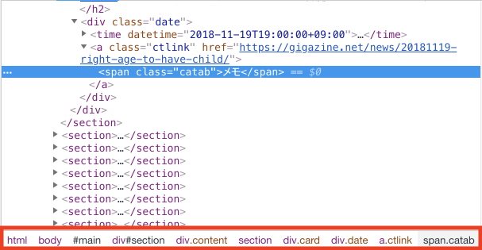
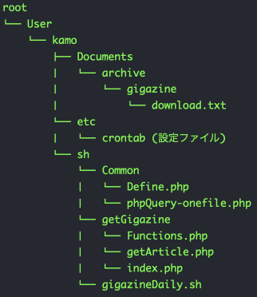

#### 「PHPでスクレイピングして楽になったカモ」
#### 〜ちょっとした効率化で集中力を分散させない〜

---

Who Am I?

>>>

I'm Kamo

>>>

- 名前：カモ（本名：イドンホン）

- エンジニア歴：1年7ヵ月

- 業務：[ ‘PHP’, ’Javascript’, ’CSS’, ’jQuery’, ’Linux’ ]
 - 不動産業者間のコミュニケーションツールの保守開発

- 個人：[ ‘PHP’, ‘Vue’, ’React’, ’SCSS’, ’Shell’ ]

>>>

<!-- - 近況：[ ‘node.js’, ’非同期処理’, ’firebase’, ’オブジェクト’, ’ストリーム’, ‘可視化’ ] -->

- 趣味
 - ブックマークしたサイトを眺める
 - 毎月1日に映画を見る
 - 積読の処理
 - amazon echoで一人カラオケ
 - やりたいことを探す

---

# 本日の話題

>>>

### PHPでスクレイピングしたときの話

>>>

- なぜスクレイピングするのか
- どんな技術でスクレイピングするのか
- スクレイピングをする際の注意事項
- コード書いたときの感想/躓いたところ
- 書いた後の感想

>>>

### が、その前に。

>>>

## 一つ訂正

>>>

>>>

### クローリングからスクレイピングまで
### PHPでした話

---

- なぜスクレイピングするのか
- どんな技術でスクレイピングするのか
- クローリング/スクレイピングをする際の注意事項
- コード書いたときの感想/躓いたところ
- 書いた後の感想

>>>

# 突然の質問！

>>>

Wifi繋がってます？

>>>

うちは繋がってない…

>>>

お仕事中に集中

>>>

更新のタイミングで情報を見たい

>>>

## こんなことを思っているうちに

>>>

---

- なぜスクレイピングするのか
- どんな技術でスクレイピングするのか
- クローリング/スクレイピングをする際の注意事項
- コード書いたときの感想/躓いたところ
- 書いた後の感想

>>>

難しそう

>>>

そんなに難しくない

>>>

>>>

さっと作れる

コマンドラインで「php ファイル名」を打つだけ

	発表者がよく使う

>>>

Simple HTML DOM Parser

Goutte

	phpQuery

>>>

決まった時間に実行したい

定時実行のスケジュール管理ができる

	エンジニアっぽい（？）書き方がしたかったから

---

- なぜスクレイピングするのか
- どんな技術でスクレイピングするのか
- クローリング/スクレイピングをする際の注意事項
- コード書いたときの感想/躓いたところ
- 書いた後の感想

<!--ではこの技術をもとにクローリング、スクレイピングをするにあたって注意することは何かについてお話させていただきます-->
<!--ここから文字が多めになるかと思いますが、重要なことなので皆さん聞いていただければと思います-->

>>>

# 不法なのか？
<!--よくクローリングとスクレイピングを語るとき、法律的にはグレーゾーンではないかという話をよく耳にします-->
<!--そこで一つ言いますと、クローリングとスクレイピングは基本的にサイトが認めていない方法です-->
<!--ということは「不法じゃないの？」って思う人もいるかも知れませんが、そうではありません-->

>>>

技術自体の良し悪しではない

<!--これらの技術ははっきりと白黒をつけることが難しい領域です-->
<!--クローリングは検索エンジンにおいて自分のサイトが、いかに検索されやすいかを判断するための指標となるので、サイト運営側からしたらSEO対策として重要とされます。-->
<!--一方、クローリングの使い方を注意しなければ事件に巻き込まれることもあります。-->
<!--代表的なのは日本では「岡崎市立中央図書館事件」または「Lirbahack事件」とも呼ばれている事件です-->
<!--今では技術者の間で誤認逮捕だと認識される事件ではありますが、その分クローリングするときのルールを守るように呼びかけることにもなりました。-->
<!--なので、技術的の良し悪しというより、-->

>>>

### 使い方が適切であれば
### 法に触れるケースはすくない
<!--このように一概に「データを持ってきて使えばいい」と言い切れない領域なので、-->
<!--守るべき作法にしたがって、サイトの運営に支障がないくらいの程度であれば、必要な情報は持ってこれます。-->
<!--なのでここではその基本的な作法についてお話させていただきます-->

>>>

# クローリング

非構造化されたデータをそのまま取得

htmlをそのまま取得

<!--クローリングとは、プログラムがインターネット上のリンクを辿ってWebサイトを巡回し、Webページ上の情報を複製・保存することを指します-->
<!--一部、ネットでスクレイピングに関する説明を見ると、このクローリングの部分までひっくるめてスクレイピングの話をする記事があります-->
<!--なので、ここで一つ、はっきりしたいことを言いますと、あくまでもサイトから情報を複製して持ってくることは「クローリング」と言います-->
<!--また、クローリングを行うためのプログラムを「クローラ」、「スパイダー」と呼びますが、-->
<!--ここではクローラーと言葉を統一させます-->

<!--念のために一言を申し上げますと、一応、クローリングというタイトルで説明していますが、-->
<!--あくまでもクローリングとスクレイピングの概念的な話を分けるためにこの構成にしているだけです-->
<!--スクレイピングするときも一度クローリングをした上で必要な情報を抽出しているので、-->
<!--これからの説明はクローリングとスクレイピングをワンセットにした流れにおいて考えておくことだと思ってください。-->

<!--ちなみに後で経験談を話すときも触れますが、今回自分はクローリングした情報を２つに使い分けしています。-->
<!--一つはサイトからクローリングで複製した情報をスクレイピングの際に必要な情報だけを取るためのスクレイピング用として使って、-->
<!--もう一つは、クローリングで複製した情報をhtmlとしてそのまま保存するための保存用として使います。-->

>>>

## 以下に限る

<!--では、クローリングした情報はどんなふうに使えば適切に使えるのかについて話します。-->
<!--クローリングするときの使用目的は次のケースに限った使い方をお願いします。-->

- 
情報解析と保存

- 
文章、画像、(音声、映像)

- 
個人の使用

<!--クローリングする目的は情報源から要素の分析をして、ほしいデータだけ抽出する情報解析のための使用、またそのための保存でお使いください-->
<!--これは欲しい情報だけを取得するためのAPIが存在せず、そのために情報ごと持ってくる必要がある場合に限ります。-->
<!--もしサイトのAPIが存在し、かつ必要な情報がAPI内にある場合はそちらを積極的に使うことをおすすめします。-->

<!--次に、クローリングで持ってこれる情報というのは文章、画像、音声、映像に限ります。-->
<!--あくまで持ってこれるだけなので、法的リスクがないとは限りません。-->
<!--例えば、音声と映像の場合、「海賊版」に注意しなければいけません。-->
<!--クローリングする「映像、音声」は知らないうちにいわゆる、「違法サイト」経由のものになる可能性もあります。-->
<!--なので、それなりの法的なリスクが十分ともないますので、個人的にはおすすめしません。-->
<!--一方、文章や画像はビックデータ分析を目的とした使い方、と機械学習の学習用データとしての使い方があるので、比較的リスクは低いとされます。-->
<!--ただし、低いとされているだけで、もし収集元のデータの所有者の意向次第では収集済みのデータも含め、削除しないといけない場合があります。-->
<!--よっぽど制限をしないといけないくらいアクセスされるとか、取ってくるときのマナーを守らないといった場合、この処置を受けるかもしれません。-->

<!--では、クローリングしたて持ってきたのはいいものの、どこまでの範囲で使えるのかについてですが、-->
<!--クローリングしてもってきた情報は個人で使用することを前提していただきたいです。-->
<!--クローリングした情報を元にニュースサービスを展開する方もいますが、情報元に許可を得たり、掲載から何日まで表示させるかを明記したりしているので-->
<!--サービスとして使用する際の範囲と法律の部分に関してはあまりにも想定しなくてはいけないケースが多くあるため、ここでは説明を省きます-->
<!--基本的にはクローリングした内容をそのまま転載したり、貼り付けたりすることは著作権法に触れることになりますので、クローリングからサービス展開を考えている方は参考にしてください-->

>>>

自分用で使おう

<!--なので、あとあと面倒くさくなることが嫌な方は、あくまで自分で使うためのものにしてくださいね-->
<!--それでもさらに詳しくどこまで使用していいのかが気になる方は各サイトの利用規約を見ていただくと丁寧に書かれているのでそちらを参考にしてください-->

<!--ここまではクローリングの定義とその使用できる範囲について話しました-->

>>>

## 基本的なお作法
## (クローリング)
<!--ここからはクローリングにおいて、法的な問題及びサービス運用側から起こりうる問題を事前に防ぐためにどうすればいいのかについて話していきます-->
<!--とはいえ、法律の何条の何項を守らないといけないとかの話ではなく、サービス運用をする側の迷惑にならないよう、基本的なお作法だけについて話して行きます-->

>>>

## 自分を明かす

<!--まず、サイト内でクローリングする際は自分が誰なのか明かす習慣をつけましょう-->

<!--基本的に「持ってくるだけだったらUAを指定しなくてもOK」とか「クロームのクローラを使えばいい」という考え方をもっている方がいるかも知れません。-->
<!--確かに持ってくるだけならそれでもいいでしょう-->
<!--ただ、サービス運用をしている側からしたらPVの指標にノイズが出たり、攻撃を受けていると判断したりする恐れがあります-->
<!--他にもサービスが想定しているユーザーに向けたページビューや体裁が送れないとか-->
<!--人間のユーザによる閲覧数の集計を取りたいのにアクセス解析の精度が落ちるとかの問題にも繋がります-->

<!--なので、「サービスを運営する側にやさしい」クローリングをする場合、自身の正しいUserAgentを指定し、かつメールや連絡先なども添えておくことをおすすめします。-->
<!--つまり、ありのままの自分を見せます-->

- 
ありのままの自分を見せる

<!--そのため、自分の場合はUserAgentをこのような書き方をしています-->

  

<!--自分は◯◯というボットで人が作ったクローラーですよ〜ということを書き、最後にメールアドレスをのせます-->
<!--このように書くことで、何か問題があった場合、サイトの管理者から連絡を受けられることができるので、必要最低限の作法と言えるでしょう-->

- 
お問い合わせに事前連絡

<!--また、最善策としては事前にサイトのお問い合わせ枠にてクローリングをしてもいいかどうかを聞いて見て許可を得る方法があります-->
<!--余談ですが、自分も一度お問い合わせをしてみたこともあった、その結果今日のスライドも大幅修正になりました-->
<!--経験談でも話しますが、某緑のQi◯taさんからクローリングしようとしたら、-->
<!--連絡が来て許可がおりなかったので、今日のスライドの半分くらいを書き直すことになりました。-->
<!--みなさんもクローリングする前はお問い合わせで聞いてみることをわりとガチでおすすめします-->

>>>

## クローラーの行き止まり
- 
ボットを禁止するための技術的手段

- 
noindex nofollow

- 
robots.txt

<!--次は、サイト内のどんなところを取らないようにすればいいのかについて話します-->
<!--大きく2種類がありまして、クローリングする際にhtmlのタグの中を見る場合とサイト自体で制御されているボットの一覧を見る場合があります-->

<!--タグ-->
<!--タグでnofollow,noindexが設定されているリンクはクローラーで辿らないようにしましょう-->
<!--大体の場合、クローリングの行き止まりとなって、気にすることはないので、わざわざ取るようなことをしなければOKです。-->
<!--ちなみに、このキーワードが入っている時というのは会員のみが閲覧するページ、広告の表示、外部リンクへ飛ぶ場合がこれに当たります-->
<!--これらはユーザーにそのページまでクローリングさせないための、サイトを運営する方々が処置した手法なのでその優しさにしたがいましょう-->

<!--robots.txt-->
<!--サイト自体で制御されるボット一覧についてはサイトのホームとなるページから確認する事ができます-->
<!--例えば、自分がよく行っているサイトの方で言うとですね-->
<!--（ネットの操作でgigazine参考ページへ）-->
<!--このファイルはサイト内でどんなクローラーにどのようなページへのアクセスを制御するのかについて書いた規約です-->
<!--気をつけることは記載されているクローラーの規約にDisallowになっているところがある場合、該当するページからはクローリングしないことです-->
<!--サービス側からしたら何かとトラフィックに制限があるから止めるとか、管理画面へのアクセスを止めるとかの理由から制限をかけているので素直にしたがいましょう-->

>>>

## サーバへの負荷

- 
サーバーに高負荷をかけない

<!--一気に持ってこようとしない-->
<!--最後に、クローリングの際に、よく言われることが欲しい情報があっても一気に取ってこないことです-->
<!--サービスを提供するサーバーに一気に高負荷をかけるとDDoS攻撃を受けていると勘違いさせてしまうので一件ずつ取ってきたら、時間をおいてまた取ってくるようにしましょう-->
<!--これは先ほどクローリングの使用目的を説明するときにも触れましたが、APIがあってかつそのAPI内に必要な情報があればそれを積極的に使う理由と繋がります-->
<!--サイト側が指定したAPIには１時間で利用できるクローリングの回数とかどれくらいの間隔で持ってきたらいいのかとかの規約が指定されています-->
<!--なので、APIを使いますとクローリングする側もサイトを運用している側もwin-winとなリますのでそちらがあればぜひ使いましょう。-->
<!--ではAPIがない場合はどれくらいの時間をおきながら、持ってきたらいいのかについてですが、-->
<!--正確には、サイトを運用するサーバーが強いか弱いかによってまた違います。-->
<!--個人的には1分かそれ以上で取ってくることがいいかなと思います。-->
<!--人によっては１日に一回だけでいいやとなる人もいますが、-->
<!--自分はキューレーションサイトの更新分を１日２回取ってきているので、そこまでの間隔はおいていないです-->
<!--もし何か問題があった場合は、ボットに記載したメールに運営側が連絡をしてくれるので、その時の運営の指示に従えばOKです-->

>>>

## まとめると

<!--ここまで長々と作法についてお話しましたが、三行でまとめると、-->

- 
ありのままの自分で、

- 
サービスのルールにしたがって、

- 
余裕を持って一個ずつ取得する

<!--ありのままの自分で、サービスのルールにしたがい、ひとつずつ余裕を持って取ってくる-->
<!--ということになります。-->
<!--もちろん、クローリングはサイトが認めていない方法であることを再度、念頭においてください-->

---

# スクレイピング

<!--それではお待ちかねのスクレイピングについてのお話になります。-->

>>>

## 情報解析

	
	
	
	
	
	
	

<!--ここでもう一度情報解析について触れていきますと、-->
<!--そもそも自分は「情報解析」という言葉がピンと来なかったです。-->
<!--そこで調べて見ると情報解析とは、「情報の構成要素を細かく理論的に調べることによって、その本質を明らかにすること」を指します-->
<!--これはイメージ的には、クローリングした情報を必要なデータ形式に変換し、その構造を「解析」してから、必要なデータを選定することです。-->
<!--この情報解析で得た情報はパブリックな場で公開せず、個人で利用するのであれば、取得した情報をスクレイピングすること自体、セーフです。-->
<!--ただし、クローリングのときにも触れたように、収集元のデータの所有者の意向次第では、すでに収集したデータも含め、削除しないといけない場合がありますので今まで集めた情報が消えるリスクは十分あります-->

<!--概ね、この情報解析を守っていれば、そんなに気にすることはないかと思いますが、解析する際は次の2点だけ注意しましょう。-->

>>>

## 注意点１
## 個人情報

<!--一つは取り出す情報についてです-->
<!--これはそのままの意味で、中に個人を特定できてしまうような情報が書かれていることはないか確認する必要があります。-->
<!--例えば、このような情報です-->
- 
個人識別符号

<!--免許の番号、マイナンバーなどがこれに当たらります。-->
- 
身元の識別と追跡が可能な情報

<!--住所、電話番号などがこれに当たります。-->
<!--日本だとこれらの情報を扱う際に、行政でも厳密に扱っているのでもし情報ろうえいがあった場合の責任が取れるのであれば収集してもいいですが-->
<!--ほとんどの場合、そこまでの責任が負えないかと思いますので、このような情報は集めないようお願いします。-->

>>>

## 注意点２
## DOMツリー

<!--次に、もう一つは取り出す際の方法についてです-->
<!--これはあとでも説明しますが、スクレイピングで苦労をしないための注意事項です。-->
<!--守らなくてもいいですが、相当な労力を使います-->
<!--これは何かと言うとhtmlごと持ってくる場合、DOMツリーで持ってきましょうということで-->
<!--理由はそのまま持ってきて使うと、正規表現で必要な部分を取り出すとかhtmlファイルを一行ずつ取ってくるとかの問題があるので処理も汚くなりますし、-->
<!--PHPでさっと作ることが難しくなるからです。-->
<!--ちなみに、DOMツリーはクロームのデベロッパーツールを開くとここでご確認できます。-->

---

- なぜスクレイピングするのか
- どんな技術でスクレイピングするのか
- クローリング/スクレイピングをする際の注意事項
- コード書いたときの感想/躓いたところ
- 書いた後の感想

<!--では、いよいよ経験談の話しへ移りたいと思います-->

>>>

## 取得しようとしたサイト

<!--ここでもう一度自分がスクレイピングする理由をいいますと-->
<!--普段、よく見ているサイトがありまして、更新が１日に２回以上されていることもあり、できるだけ効率的に情報を持ってこれないかなと思っていました。-->
<!--よく見ているサイトとしては-->

緑の某プログラミングナレッジのコミュニティ

Gで始まる某IT系ニュースサイト

<!--よく海外の情報や最近のプログラミングの動向を確認するために見ています-->

>>>

## 問題点
<!--しかし、ここには問題点がありまして、序盤でもいいましたように-->

<!--業務中の集中力には限りがあることと-->
<!--更新される分をその都度追いかけて見るほど日中の余裕はないことです-->

<!--つまり、-->

>>>

# 両立できない！

>>>

## やろうとしたこと

<!--そこで一度、wgetというLinuxのコマンドでサイトのページごと持ってくるような荒いやり方でも試したことがありましたが-->
<!--記事をタグ毎に分類したり、スクレイピングの正しいやり方でやったりする経験がなかったため、次のような目的を持った情報収集をしようと考えました-->

タグ毎に分類してローカルに保存

そのサイトで使われるタグを使用

毎回差分だけローカルに保存

サービスに迷惑をかけない

定期実行

<!--持ってきた情報はタグ毎に分類してローカルに保存する-->
<!--使用するタグはそのサイトで使われているタグのみにする-->
<!--毎回の実行で持ってくるのはローカルと比べてないものだけを持ってくる-->
<!--ちゃんとしたやり方で迷惑をかけない-->
<!--更新がかかるタイミングを測ってアクセスが集中しないタイミングでクローリングとスクレイピングをする-->

<!--ことです-->

>>>

### 大まかな流れ

<!--これを意識して実際の一通りの流れをイメージで表しますと-->

	
	
	
	
	
	
	

Gで始まる某IT系ニュースサイトでは取得成功

>>>

### しかし、今日に至るまで
### 思いがけの問題点が…
<!--このままうまく行けばよかったのですが、思いがけない問題点が３点出てきたので、今回はその話をしていきます-->

---

## メインの問題

 DOMツリーで取得できない(ように見えた)

 サービス側からメール 

 crontabの設定 

<!--一個目は、DOMツリーで取得する際のライブラリーがちゃんと動いていないように見えて取得できるまで遠回りをしたことです。-->
<!--これは単に私のミスで起きたことなのでその失敗談と得られた経験についてお話します-->

<!--次は、スクレイピングする前にお問い合わせをした結果のことです-->
<!--実は今日の話をする際にソースコードを見せながら説明しようと思っていましたが、-->
<!--某プログラミングナレッジのコミュニティからお叱りをいただいたので、今日まで間に合いませんでした！すみません！-->

<!--最後に定期実行するのにコマンド上でうまくいかない問題があったことです-->
<!--これはパース指定とコマンド上の権限問題でおきたことについて話します-->

>>>

## DOMツリー取得の失敗

<!--phpQueryで書くとこのような書き方になります。-->
<!--こちらは今、githubに上がっているキューレーションサイトから取得する際のものを書いていますが-->
<!--当時、取得できない問題が起きていたのはプログラミングナレッジサイトの方でして、書き方自体は今お見せしている物とほぼ同じでした。-->
<!--この時点で、すでに赤枠で表示されているところをDOMツリーの構造で取ってこようとしましたが、値がNULLで困っていました。-->

>>>

# 原因

data属性の指定し忘れ

>>>

# 解決策

<!-- phpQueryで取得できず。
諦めてfile_get_contentsで取得、一度htmlファイルとしてローカルにおいてから一行ずつ読み込む
しかし、必要な情報を取ってくるには正規表現での工夫が求められた。
また、一行のバイト数が多すぎて取れないところもあった。 -->

---

## これに至るまで学んだこと

>>>

<h3>ファイルをすべて読み込む</h3>

自分でいい感じに分割しないといけない

自分で正規表現を書かなくてはいけない

>>>

<h3>ファイルを一行ずつ読み込む</h3>

自分で分割しないといけない

バイト制限がある

>>>

# 結論

<h2 class="fragment fade-in">DOMツリーで取得！</h2>

---

## サービス側のメール

代案を使う

サービスのAPIを使う

>>>

## APIで取得する場合

[LeeDDHH/qiita_daily](https://github.com/LeeDDHH/qiita_daily)

---

## crontabの設定

>>>

<h2>cronが動かないケース</h2>

相対パスの指定が効かない

>>>

<h2>cronが動くケース</h2>

フルパスの指定は効く

>>>

# 原因

cron実行時のカレントディレクトリ

↓

実行ユーザーのホームディレクトリ

>>>

特にユーザー指定がされてないため

rootがホームディレクトリ

---

- なぜスクレイピングするのか
- どんな技術でスクレイピングするのか
- クローリング/スクレイピングをする際の注意事項
- コード書いたときの感想/躓いたところ
- 書いた後の感想

>>>

## スクレイピングする前

スクレイピングの前にAPIを確認

スクレイピングの前に事前連絡をしよう

>>>

## スクレイピングした後

サービス運用側の指示に従う

その日の差分はその日のうちに

いつもデータを消すリスクを意識しよう

---

# 最後に

>>>

<!--１．最初はそもそもwgetで取っていた-->
 <!--スクレイピングに詳しくなかったときのことで、この段階ではクローリング/スクレイピングの作法が分からなかった-->
 <!--この段階ですでに、タグ毎に分類ができなかった問題が発生していた-->
<!--２．最初はdata属性が取れなかった-->
 <!--どうしてもphpのDOMparserで取れない原因が分からなかったので文字列で取っていた-->
 <!--でも、実際は取ってくるときのmetaタグのdata属性を抜き取ることで、JSON式の整形ができるので、こっちの方が断然楽-->
<!--３．最初は文字列で取っていた！-->
 <!--ここが実はスクレイピングしてどうしてもいい感じに取れないときに使うべき最終手段であった。-->
 <!--なのに、正規表現をいっぱい使って見づらいコードになったり、他のサイトでの応用が聞きづらいコードになっていた-->
<!--４．最初はfile_get_contentsで取ってきた！-->
 <!--cURLで取ると速度も早いし、リクエスト失敗時に出てくるWarningの抑制もthrowで抑制できる-->
<!--５．最初はAPIの存在に気づかなかった！-->
 <!--当初はqiitaの記事を取ってくる予定だった-->
 <!--しかし、お問い合わせの結果、サーバーへの負担になるからやめろって言われた！-->
<!--６．crontab設定時に注意-->
 <!--パスの指定は絶対パスで-->
 <!--実行するshellファイルに実行権限があるか確認する-->

<!--取得に失敗する状況が起きないか-->
